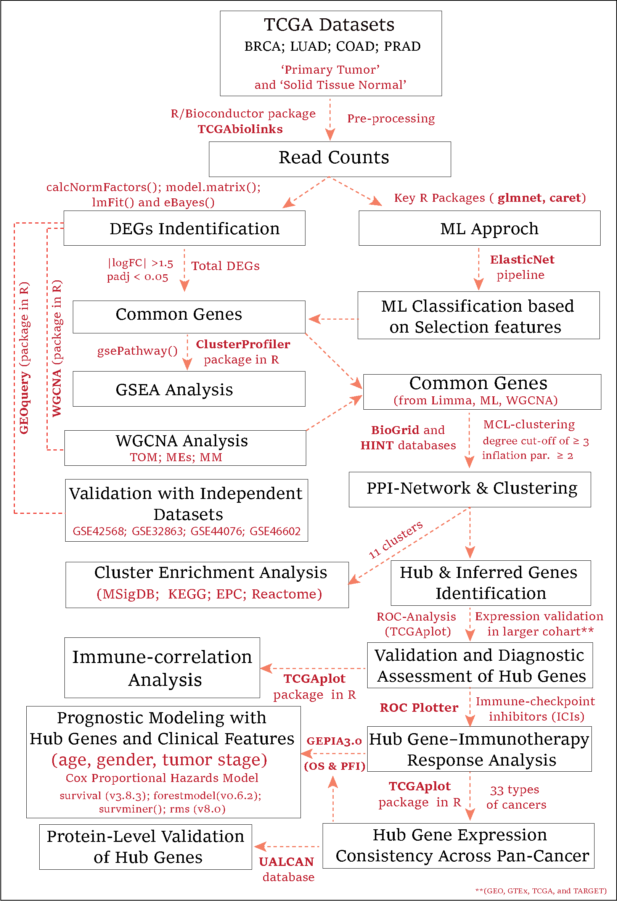

# 🧬 A comprehensive bioinformatics workflow for identifying and validating hub genes across multiple cancer types using TCGA data.
Cancer remains a leading cause of global mortality, with breast, lung, colorectal, and prostate cancers among the most prevalent. Despite their distinct clinical and molecular features, this study aimed to identify conserved molecular signatures across these four selected cancer types (SCTs) to uncover potential pan-cancer diagnostic and prognostic biomarkers, as well as therapeutic targets. Transcriptomic data from The Cancer Genome Atlas (TCGA) were systematically analyzed using a rigorous bioinformatic workflow, as outlined below.

*Comprehensive analysis workflow*

## 📋 Overview

This pipeline integrates multi-omics data analysis, machine learning, and network biology to identify robust cancer potential biomarkers with clinical relevance across major cancers, including breast, lung, colorectal, and prostate cancers.

## 🔄 Workflow Steps

### 1. 📊 Data Acquisition & Pre-processing
- **Data Sources**: TCGA datasets (BRCA, LUAD, COAD, PRAD)
- **Sample Types**: 'Primary Tumor' and 'Solid Tissue Normal'
- **Tools**: `TCGAbiolinks` R package
- **Pre-processing**: Read Count normalization using `calcNormFactors()`, `model.matrix()`

### 2. 🔍 Differential Expression Analysis
- **Methods**: `lmFit()` and `eBayes()` from limma package
- **Thresholds**: 
  - `|logFC| > 1.5`
  - `padj < 0.05`
- **Output**: Identification of significantly differentially expressed genes

### 3. 🎯 Multi-Method key Gene Identification
| Method | Approach | Key Features |
|--------|----------|--------------|
| **DEG Analysis** | Limma-based | Traditional differential expression |
| **WGCNA** | Co-expression networks | TOM, MEs, module membership |
| **Machine Learning** | ElasticNet pipeline | Feature selection with `glmnet` and `caret` |

### 4. 🌐 Network Analysis & Functional Enrichment
- **PPI Construction**: Integrated entries from BioGrid and HINT databases to create a comprehensive dataset of documented human-human (Homo sapiens) PPIs.
- **Clustering**: The Markov Clustering Algorithm (MCL) --> (degree cut-off ≥ 3, inflation parameter ≥ 2)
- **Gene Set Enrichment Analysis (GSEA) Common DEGs**: 
  - `gsePathway()' function from the clusterProfiler package in R
  - pvalueCutoff < 0.05, minGSSize = 2, and maxGSSize = 500.
- **Functional enrichment analysis of clusters highlighted several significantly overrepresented pathways**: 
  - MSigDB, KEGG, EPC, Reactome databases: We integrate all databases for pathway analysis to ensure comprehensive coverage.
  -  pvalueCutoff < 0.05

### 5. ✅ Hub Gene Validation
- **Expression Level**: TNMPlot validation: It includes 56,938 unique samples from various sources, with 15,648 normal, 40,442 tumors, and 848 metastatic tumor samples. This large cohort provides a comprehensive view of gene expression in normal and cancer tissues (https://tnmplot.com/analysis/).
- We examined the expression patterns of the hub gene sets (Up & Down) across the four selected cancer types (breast, lung, colorectal, and prostate cancers) using a large cohort comprising these same cancers.
- **Protein Level**: UALCAN database: It is a comprehensive, user-friendly, and interactive web resource for analyzing cancer OMICS data (https://ualcan.path.uab.edu/)
- **Diagnostic Power**: ROC analysis with the TCGAplot package in R.
- **Pan-Cancer**: We check the expression consistency across 33 TCGA cancer types of hub gene sets (Up & Down).
- **Primary and metastatic tumors**: We also evaluated the expression consistency of the hub gene set between primary and metastatic tumors across the elected cancer types (breast, lung, colorectal, and prostate cancers) using GeneChip datasets.
### 6. 🏥 Clinical & Immunological Analysis
- **Survival Analysis**: Cox Proportional Hazards Model
     - We used GEPIA 3.0 to assess overall survival and progression-free survival for the hub gene set, both within the four selected cancer types (breast, lung, colorectal, and prostate cancers) and across pan-cancer cohorts (33 types of cancers).
- **Comprehensive pipeline for survival analysis**: using Cox proportional hazards models, integrating both clinical variables and gene expression data
    - survival + rms → Core Cox modeling & validation.
    - survminer + forestmodel + ggplot2 + ggpubr → Visualization (KM curves, forest plots, HR plots).
- **Immune Profiling**: 
  - Immune-correlation analysis (including immune checkpoint genes (ICGs), chemokines, chemokine receptors, immune stimulators, and immune inhibitors)
  - Immune-checkpoint inhibitors response (PD-1; PD-L1; CTLA-4)
    
✉️ Please feel free to write to me 🧑‍🔬 at *aftab07alig@gmail.com* if you encounter any issues. I’ll be happy to address all your queries regarding this analysis.]]]
